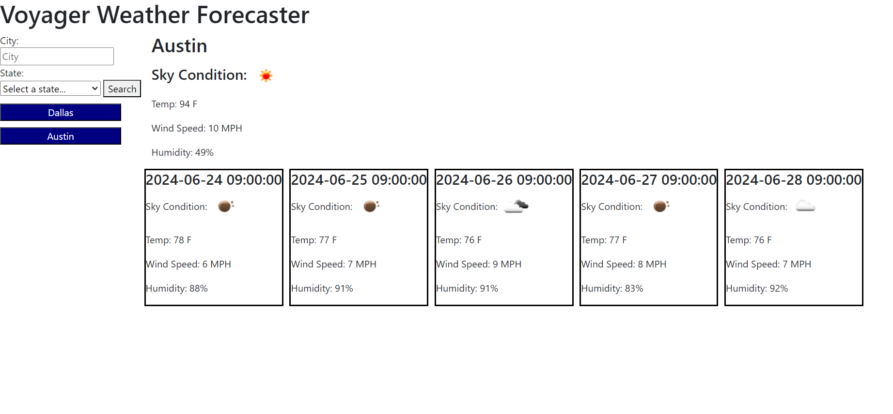

# Voyager Weather Forecasting

## Description

This application is a 5-day weather forecasting site with a search history function.

## Instructions for Use

Upon opening the application, weather for Austin will be displayed. On the left-hand side, use the search bar and dropdown to search the city and state to search. After searching, the application will display the current weather and forecast for the next 5 days for the city searched. A new button will appear in your search history so that the city's weather forecast may be searched again on click.

## Link to Deployed Application

Link: https://shermanburwell3.github.io/weather-forecast-application/

## Screenshot

## Credits

API used from Open Weather Map.

Link: https://home.openweathermap.org/

Used code from coding-boot-camp for starting variables and api key generation.

Link: https://coding-boot-camp.github.io/full-stack/apis/how-to-use-api-keys

Code for displaying weather icon from the Open Weather Map API was found on Stack Overflow.

Link: https://stackoverflow.com/questions/44177417/how-to-display-openweathermap-weather-icon

Code for creating a dropdown was borrowed from Hub Spot.

Link: https://blog.hubspot.com/website/html-dropdown#how-to-make-a-dropdown-menu-in-html

Snippet for all 50 state options was provided by Free for Matter.

Link: https://www.freeformatter.com/usa-state-list-html-select.html

Setting the default option in a dropdown was made possible by code from Geeks For Geeks.

Link: https://www.geeksforgeeks.org/how-to-set-the-default-value-for-an-html-select-element/

Code for removing child elements was referenced from Stack Overflow.

Link: https://stackoverflow.com/questions/3955229/remove-all-child-elements-of-a-dom-node-in-javascript

A lot of help for debugging was provided by the Xpert Learning Assistant from Bootcamp Spot.

Link: https://bootcampspot.instructure.com/courses/5313/external_tools/313

